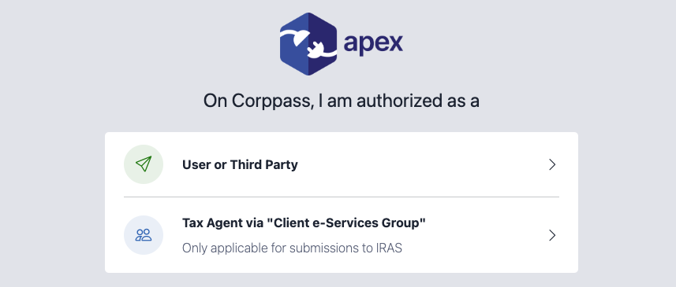

# Authorization Profile

This guide explains the Authorization Profile selection screen as part of the Authorization Flow. 

The Authorization Profile selection screen shown below will <u>**ONLY**</u> be displayed when the following scope is passed in as part of the parameters when calling the Authorization URL.

- **EmpIncomeSub** - Submission of Emloyment Income Records

## 1. Definitions

- **User or Third Party** - This option is for:
	1. Users authorized by "Assigned e-services" (i.e. staff authorized directly by employers and submitting for employers)
	2. Tax agents authorized via "Assigned Client e-Service" on Corppass

- **Tax Agent via "Client e-Services Group"** - This option is for:
	1. Tax agents authorized via "Client e-Services Group" on Corppass
