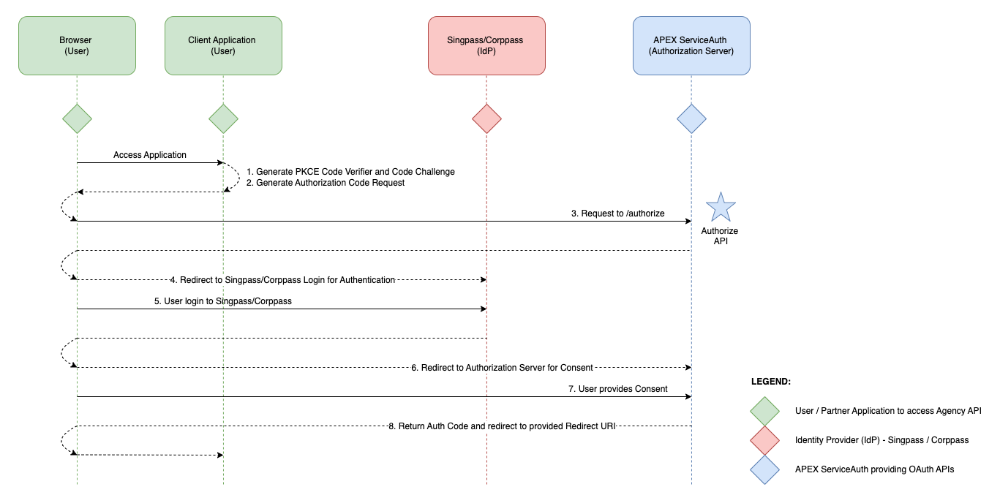
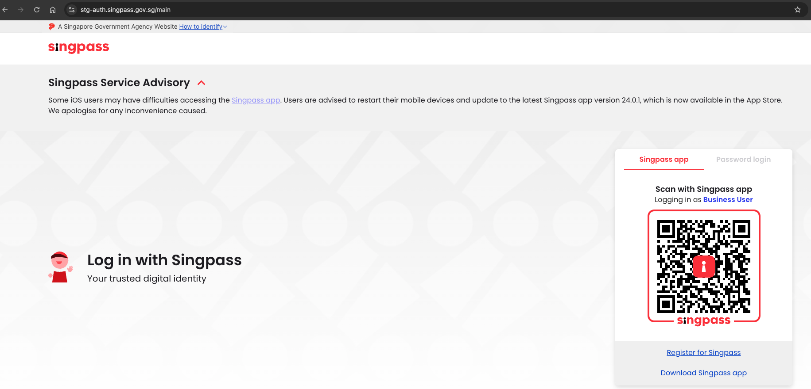
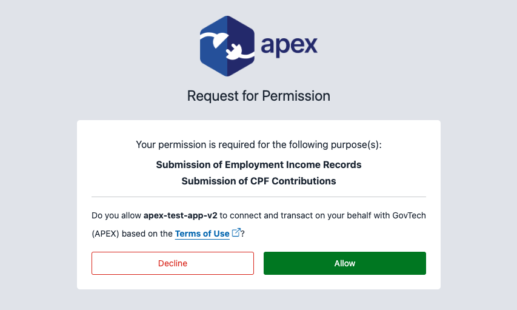
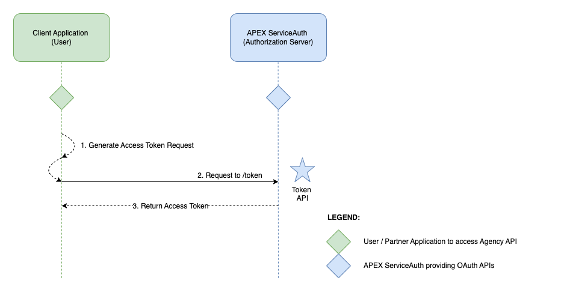

# Using OAuth 2.1 Auth (with PKCE)

This guide explains how to implement the [OAuth 2.1](https://oauth.net/2.1/) Authorization Code Flow to allow a
Corppass User to grant a third-party Client Application access to the Corppass User’s
protected resources.

> Before continuing, please ensure that you have already prepared:
>
> 1. [At least 1 application](/sections/consuming/v2/create-application.md)
> 1. [At least 1 API Key](/sections/consuming/v2/api-keys.md)
> 1. [Subscribed to an OAuth 2.1 protected API](/sections/consuming/v2/subscribe-api.md)
> 1. [Created and publicly hosted a JWKS endpoint](/sections/oauth/create-jwks-endpoint.md)
> 1. [Created an OAuth 2.1 Client from an application](/sections/oauth/client.md)
>
> If you need a recap on the above, you may review the [prerequisite section for consuming APIs](/sections/consuming/v2/introduction.md).

The OAuth 2.1 (with PKCE) flow consists of two main parts:
- Authorization Grant Flow - Runs in the Browser
- Access Token Flow - Server-to-Server Call

## Authorization Grant Flow

A request to the **Authorize API** triggers the IdP(Singpass/Corppass) authentication process. This is followed by the Authorization Server(APEX ServiceAuth) presenting a consent page to the User to obtain explicit consent from the User to allow his/her personal details to be released to the User's Client Application.

The Authorization Server(APEX ServiceAuth) will return a short-lived Authorization Code(Auth Code) at the end of this process.

The **Authorization Code** will be **valid for 5 minutes**.

_Note:<br> The Authorize API is triggered over the browser via the 302 redirect._



### 1. Generate PKCE Code Verifier and Code Challenge

In the Client Application, generate the PKCE Code Verifier and Code Challenge. Learn more about PKCE [here](https://datatracker.ietf.org/doc/html/rfc7636).

- **Code Verifier**: Random URL-safe string with a minimum length of 43 characters and a maximum length of 128 characters
- **Code Challenge**: Base64 URL-encoded SHA-256 hash of the Code Verifier

The generated PKCE code will look like this:

```
code_verifier: owFWUGrbZ3Bk5epaumy2EYkMCQZnkjoL_H79Gv02u0
code_challenge: 3yj50_1LB91nSs9DyzZ5tPZh5H0NxWLwNtYBXOpOrII
```

The Client Application sends the **code_challenge** in the Authorization Code request, while the **code_verifier** is sent in the Access Token request later.

Refer to the sample code to generate the **code_verifier** and **code_challenge** [here](/sections/oauth/sample-codes.md).

### 2. Generate Authorization Code Request

In the Client Application, generate the Authorization Code request.

The Authorization Endpoint can be found in [OAuth 2.1 Endpoints](/sections/oauth/endpoints.md).

The parameters for the Authorization Code requests are defined as follows:

- **{client_id}** is the Client Id generated in the [onboarding steps](/sections/oauth/client)
- **{redirect_uri}** is the Redirect URI of the Client Application (URL encoded)
- **{response_type}** must be "code" as only Authorization Code Grant is supported
- **{scope}** is the OAuth 2.1 scope which is provided by the Resource Server owner
- **{code_challenge_method}** is the code verifier transformation method and must be "S256"
- **{code_challenge}** is the Code Challenge used for PKCE (generated in Step 2)

Optional parameter is as follow:

- **{state}** is the Session Id value used by Client Application to maintain state between request and callback. Length of the state value should not be more than 200 characters.


### 3. Client Application sends Authorization Code Request to Authorization Endpoint

The Client Application will make a request to the Authorization Endpoint. The Authorization Code request URL should be like this:

```
{Authorization Endpoint}?client_id={client_id}&redirect_uri={redirect_uri}&response_type=code&scope={scope}&code_challenge_method=S256&code_challenge={code_challenge}
```

### 4. User is Redirected to the Login Screen

_Note:<br> If "EmpIncomeSub" is used-as/part-of the scope in the scope parameter for the previous step, User will be redirected to the Authorization Profile selection screen before the Login screen. Refer [here](/sections/oauth/authorization-profile) for more details._

The Login screen is presented to the User.

_Sample Login Screen_


### 5. User Login

The User authenticate themselves by logging in with their credentials.

### 6. User is Redirected to the Consent Screen

The Consent screen is presented to the User.

_Sample Consent Screen_


### 7. User Authorizes Client Application

The User authenticate and authorize the Client Application for the listed scope(s).

### 8. Authorization Server Returns Authorization Code

The Authorization Server redirects the User back to the {redirect_uri} provided in Step 3, with the Authorization Code.<br>


A redirected URL with parameters might look like this:

```
https://{redirect_uri}/?code=apex-cp-bfbKlXhDYKCUcx2KRa1PaxvVAI8sjdJSLqUgirKS
```
_Note:<br> If {state} was provided as part of the parameters in Step 3, the same state value will be returned as an additional parameter along with the Authorization Code._

The Client can extract the Authorization Code from the Redirect URI. In the above example, the code extracted will be:

```
apex-cp-bfbKlXhDYKCUcx2KRa1PaxvVAI8sjdJSLqUgirKS
```

## Access Token Flow

The User's Client Application server invokes the **Token API** to obtain an Access Token, which can be used to call the Agencies' business APIs for the actual data. The User's Client Application needs to provide a valid Authorization Code(Auth Code) obtained earlier from the **Authorize API** to exchange for the Access Token.

The **Access Token** will be **valid for 30 minutes**.

_Note:<br> The Token API is a server-to-server call (does not go through the browser)._



### 1. Generate Access Token Request

The Token Endpoint can be found in the [OAuth 2.1 Endpoints](/sections/oauth/endpoints.md).

Refer to [Token Specifications](sections/oauth/token-specifications.md) for more details on the Access Token request.

### 2. Client Application sends Access Token Request to Token Endpoint

The Client Application will make a request to the Token Endpoint.

### 3. Authorization Server Returns Access Token

The Authorization Server returns the Access Token in the response and the response should be like this:

```
{
  access_token: 'eyJ0eXAiOiJKV1QiLCJhbGciOiJFUzI1NiIsImtpZCI6ImFwZXgtc2lnLXYxIn0.eyJzdWIiOiIxODAwMTEwMzJDX2Y0MjVlOWM5LTc1ZjMtNDc0MS04NGNmLWM0Yjk1NWQyOWU1NCIsImp0aSI6ImFwZXgtY3Atc2FuZGJveC0yMmUwZGQyY2M2MDA2MGQ4NTBlODE0MmJiZjZiOTgzMTYzZGZhYzVhIiwic2NvcGUiOiJDcGZDb25TdWIgRW1wSW5jb21lU3ViIiwiZXhwaXJlc19pbiI6MTgwMCwiYXVkIjoiYXBleC10ZXN0LWFwcC12MiIsInJlYWxtIjoiYXBleC1jcCIsImlzcyI6Imh0dHBzOi8vc2FuZGJveC5hcGkuZ292LnNnL29hdXRoL2NwL3YyL3Rva2VuIiwiY2xpZW50Ijp7ImNsaWVudF9pZCI6ImFwZXgtdGVzdC1hcHAtdjIiLCJjbGllbnRfbmFtZSI6ImFwZXgtdGVzdC1hcHAtdjIiLCJlbnRpdHlfdWVuIjoiVDE2R0IwMDAyRyIsImVudGl0eV9uYW1lIjoiR292ZXJubWVudCBUZWNobm9sb2d5IEFnZW5jeSAoQVBFWCkifSwiamt1IjoiaHR0cHM6Ly9wdWJsaWMuYXBpLmdvdi5zZy9vYXV0aC8ud2VsbC1rbm93bi9qd2tzLmpzb24iLCJpYXQiOjE3MzY5MjUzMDAsIm5iZiI6MTczNjkyNTMwMCwiZXhwIjoxNzM2OTI3MTAwfQ.7o1EsNVneFHmkI66L6-BRJq9e7MdsDBfsmGaPzu2HDp8XdxOKlXqjlyYyXHMC5vGPHpWWUPTBBhUio68Cs36Ww',
  token_type: 'Bearer',
  expires_in: 1799,
  scope: 'CpfConSub EmpIncomeSub'
}
```

After obtaining the Access Token, the User is now able to make a request to the Resource Server with the Access Token. Refer to [Testing Business API](/sections/oauth/api-test) for more details.
