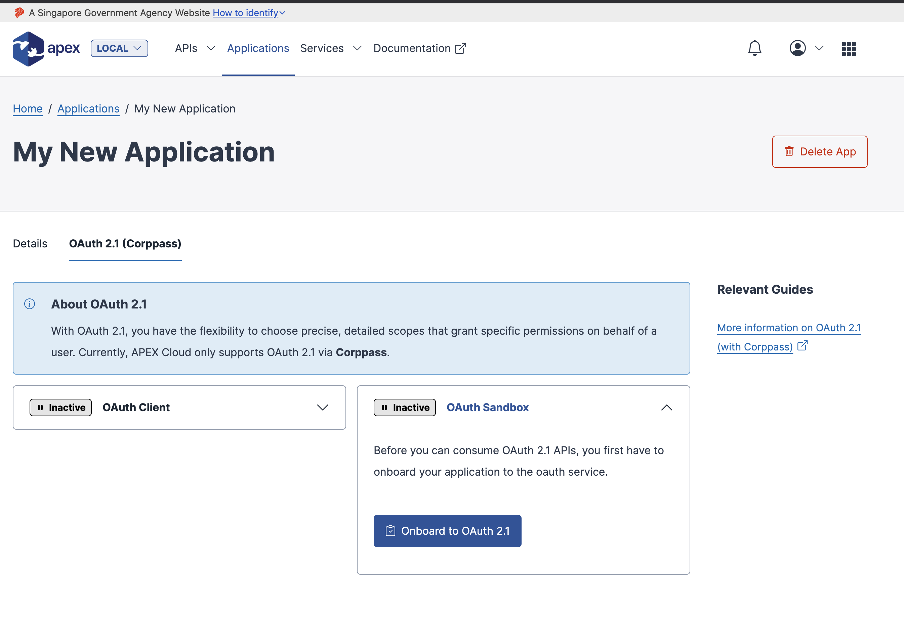
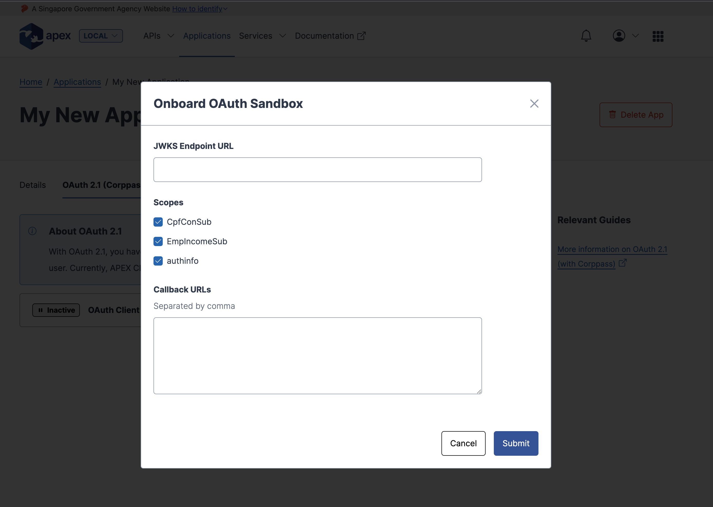
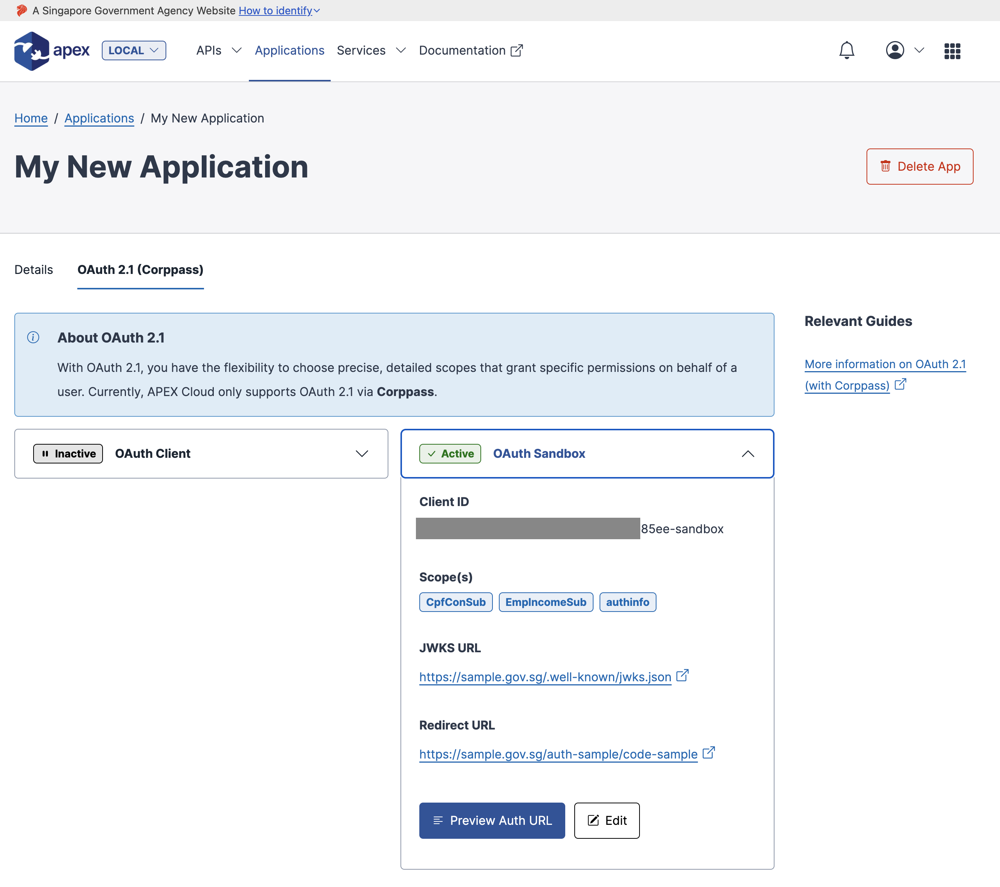
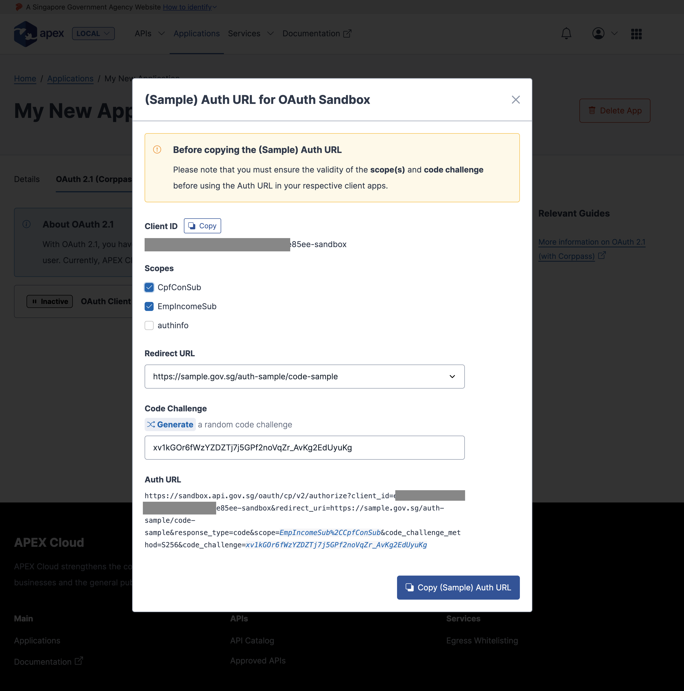

# Creating the OAuth Client

> Before continuing, please ensure that you have already prepared:
>
> 1. [At least 1 application](/sections/consuming/v2/create-application.md)
> 1. [At least 1 API Key](/sections/consuming/v2/api-keys.md)
> 1. [Subscribed to an OAuth 2.1 protected API](/sections/consuming/v2/subscribe-api.md)
> 1. [Created and publicly hosted a JWKS endpoint](/sections/oauth/pre-onboarding?id=step-3-create-jwks-endpoint)
>
> If you need a recap on the above, you may start at our [prerequisite chapter for consuming APIs](/sections/consuming/v2/introduction.md).

You may begin this workflow by navigating through:

`Applications` &rarr; `Clicking on [Application of choice]` &rarr; `Clicking on [OAuth 2.1 (Corppass) Tab]`

Before setting up the production access to OAuth 2.1, you will typically first need to create an OAuth 2.1 **Sandbox** Client to run a conformance test. The steps below will go through the end-to-end creation of the Sandbox Client. (Once verified, you may proceed to create the actual OAuth 2.1 Client by repeating the same steps below)

Also note, OAuth Clients are extended from existing applications that you have created. Please ensure that you are creating any OAuth Clients from the correct applications that you intend to use.

## Step 1: Begin onboarding

Expand the accordion on the **OAuth Sandbox** Card and select [Onboard to OAuth 2.1], a form will present itself that requires you to fill in:

1. your hosted JWKS Endpoint
2. a list of Callback/Redirect URLs for the Authorization Server to return the Authorization Code to.
3. a choice of scopes that your application will be using

## Step 2: Fill up OAuth Client fields and submit

After filling in and submitting the form, you will have completed the onboarding and process and have an actively working client.

## Step 3: Retrieve Client ID and sample Auth URL

You may select the [Preview Auth URL] button to have a quick look on the **Client ID** and an almost complete **Authorization URL** (that are are required in the next steps in the Authorization Code Flow).

By being able to get the newly created **Client ID** and **Authorization URL**, you have met the complete prerequisite to implement the end-to-end Authorization flow.

> If you need to change the JWKS Endpoint URL, scopes, or add/remove Callback URLs, simply click on the [Edit] button to do so.

!> If you delete your application, do note that the onboarded OAuth Clients from the application will also be deleted.
