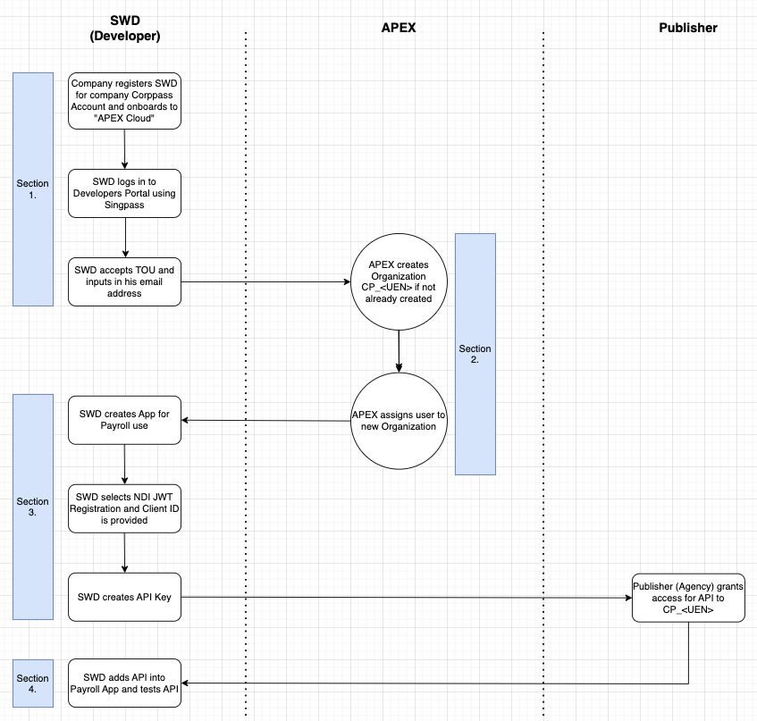

# Onboarding and Setup for Consumers (SWD)

These are the steps for onboarding and setup for application development using Apex Cloud. Nomenclature for this document can be found [here](sections/oauth/nomenclature.md).

The swim-lane is shown below.

Generally it consists of 3 sections: **_Corppass Setup_**, **_APEX Setup_**, **_Application Setup_**.

The onboarding steps are as below:

## 1. Corppass Setup

The Software Developer (SWD) will often need to simulate the payroll process and role-play the company submitter.

The Company which is registered with Corppass (which SWD is in) will need to [register the User (SWD) to the Corppass Digital Service (e-service ID) - **"Apex Cloud"**](https://docs.developer.tech.gov.sg/docs/complete-apex-user-guide/sections/onboarding/introduction?id=corppass-for-non-government-users).

The User (SWD) then logs into the [Developers Portal](https://go.gov.sg/apex-portal/) using Singpass. Refer to [Developer Onboarding for Corppass users](https://docs.developer.tech.gov.sg/docs/complete-apex-user-guide/sections/onboarding/developer-onboarding?id=corppass-users).

## 2. APEX Setup

APEX will automatically create the consumer Organization (**CP\_\<UEN\>**) for the company which the User (SWD) is registered to and add the user into this Organization.

Do double-check that you are onboarded to this Organization. 

## 3. Application Setup/upgrade

> Before continuing, please ensure that you have already prepared:
>
> 1. [At least 1 application](/sections/consuming/v2/create-application.md)
> 1. [At least 1 API Key](/sections/consuming/v2/api-keys.md)
> 1. [Subscribed to an OAuth 2.1 protected API with the application that has an API key](/sections/consuming/v2/subscribe-api.md)
>
> If you need a recap on the above, you may start at our [prerequisite chapter for consuming APIs](/sections/consuming/v2/introduction.md).

In order to transact with OAuth 2.1, you have to create an OAuth 2.1 Sandbox Client from an existing application. This process requires you to [create and host a JWKS endpoint](sections/oauth/create-jwks-endpoint.md).

After successfully creating an OAuth 2.1 Sandbox Client from your application, you can use the generated Client ID and Authorization URL to test the Business API.

Continue:

1. [Creating and hosting a JWKS endpoint](sections/oauth/create-jwks-endpoint.md)
2. [Creating an OAuth 2.1 Client (Sandbox) from an existing application](sections/oauth/client.md)
3. [Testing Business API](sections/oauth/api-test.md)
